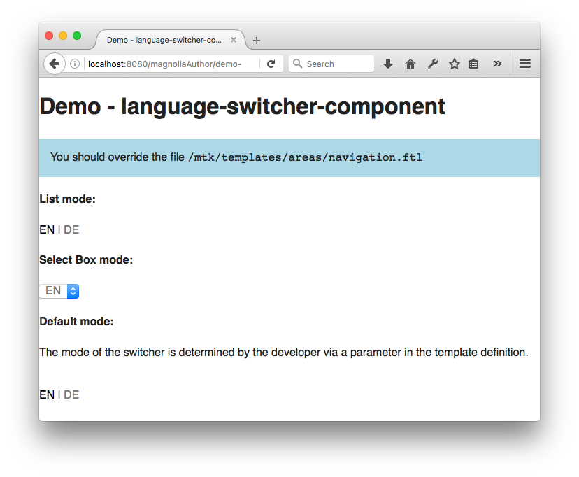

# Language Switcher - Component template for Magnolia CMS #

A simple control to allow users to switch the language on the website. Displays all languages configured for the current site.

## Features ##
The control can render as an unordered list or as a select box.
How it renders can be configured by developers via parameters in the definition, and by authors in the dialog.

## Usage ##
Use this component as is, or simply as a starting point or inspiration for how to accomplish this common task.

* Make the component template available in your page.
* Add the component to your page.
* For decent styling of the list, optionally include the webresources/css/language-switcher-component.css on your pages.

### Demo ###
To see an example page demonstrating this component, open the Pages app in Magnolia AdminCentral and import the file in 'dev/importsSamples'. (Import it directly at the root of the tree to see a demo of the included css styling.)

## Dependencies ##
None.

## Information on Magnolia CMS
https://docs.magnolia-cms.com

This directory is a 'light module'.
https://documentation.magnolia-cms.com/display/DOCS/Light+development+in+Magnolia

## License

MIT

## Contributors

Christopher Zimmermann, @topherzee
